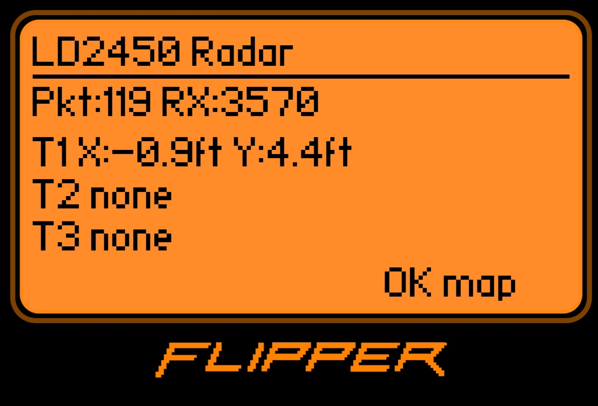

This is a simple Live LD2450 radar tracking app for Flipper Zero. Reads the raw input of the LD2450 Sensors and displays it in either its raw numeric form or in a radar.
Nice to Test if your sensors are responding properly
Features:
- UART communication with LD2450
- 3-target tracking
- Text mode
- Radar cone visualization
- Real-time moving target display




The Gpios in your flipper should be set to 5V.
*   **On USB:** If connected via USB, the 5V rail is active automatically, so this step is not required.

Connection Diagram for the LD2450 module -> Flipper Zero GPIO header:

| LD2410 Pin | Flipper Zero Pin | Note |
| :--- | :--- | :--- |
| **VCC** | **5V** (Pin 1) | but 5V is standard. |
| **GND** | **GND** (Pin 8) | Any GND pin works. |
| **TX** | **RX** (Pin 14) | Flipper GPIO 14 (USART RX). |
| **RX** | **TX** (Pin 13) | Flipper GPIO 13 (USART TX). |


## Coordinate System
The x axis in the raw input screen may be confusing the way it works is; Y is the distance away from the sensor, while x is the distance from the center line of the sensor:
```text
            +Y
             ↑
             |
   -X        |        +X
-------------+-------------
             |
          LD2450
```

##In the code This section controls the "sensitivity" for the x axis, making the dot exaggarate left or right movements on the radar.
```text
float x_normalized = x_ft / cone_half_width_ft;

/* Exaggerate left/right dot movement without changing cone lines */
x_normalized *= 1.0f;
```

Tuning this value "x_normalized *= 1.5f;" where "1.0" is raw input, "1.5" is a moderate boost, "2.0" is a dramatic boost and "3.0" is Ludicrous mode.

## Installation

**Using UFBT**

1.  Clone this repository.
2.  Connect your Flipper Zero via USB.
3.  Run the following command in the project directory:

```bash
ufbt launch
```
This will compile the application and launch it immediately on your Flipper Zero.

 Work in Progress; but still figured I share since it has gathered more interest than I had anitcipated.
## Known Issues

- Coordinate interpretation may still need calibration
- X-axis orientation may vary depending on sensor mounting
- Radar plotting is experimental
- False targets may appear near walls or reflective surfaces
